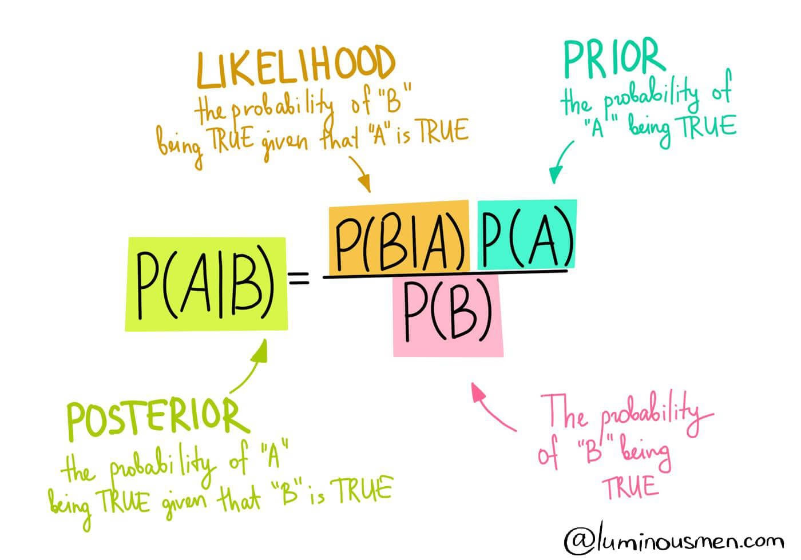
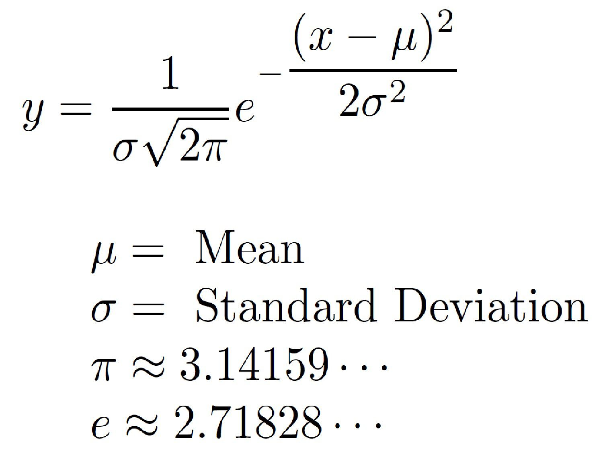

# Naive Bayes (`Gaussian Naive Bayes`) 😎

## Bayes formula:

---

## Intuition:

- Let `X` be our input features and `y` be the corresponding label.

- So, for a new input `x`, the probability of belonging to `y_1` class:

$$ P(y_1|x) = \frac{P(x|y_1)P(y_1)}{P(x)} $$

Similarly, for `y_2` class:

$$ P(y_2|x) = \frac{P(x|y_2)P(y_2)}{P(x)} $$

- **The denominator `P(x)` is the same for all classes, so we can omit it and simply use proportion to compare the probability of belonging to different classes:**

$$ P(y_n|x) \propto  P(x|y_n)P(y_n) $$

> **The aim is to calculate the probability of belonging to class `y_1` to `y_n` and choose the class with the highest probability.**

- The value of P(y_n) is the prior probability of class. It is simply the number of samples in the class divided by the total number of samples.

$$ P(y_n) = \frac{len(y==y_n)}{len(y)} $$

> If there are 5 cases with y=0, and 3 cases with y=1, then the prior probability of y=0 is 5/8, and the prior probability of y=1 is 3/8.

### Now, we have to calculate `P(x|y_n)`: 🤴🏻

- Let's say x = {x1, x2, x3,...} are the features.

- And, in naive bayes, we assume that all features are independent of each other.

Hence, the probability of P(x|y_n) is:

$$ P(x|y_n) = P(x_1|y_n)*P(x_2|y_n)*...*P(x_n|y_n) $$

- Also, we assume that all features are following a `Gaussian/Normal distribution`.

### Formula to calculate probability for a `Gaussian distribution` is:

- $\mu$ and $\sigma$ are the mean and standard deviation of the feature for the class `y_n`.

- `x` is the value of the feature for the new input.

---

### taking logarithm 😎

- Now, once we have $P(Y_n)$ and $P(X|Y_n)$, we can calculate the probability of belonging to class `y_n` by simply multiplying them.

$$ P(y_n|x) = P(x_1|y_n)*P(x_2|y_n)*...*P(x_m|y_n)*P(y_n) $$

- But, the product of many small numbers might cause underflow and we might not be able to calculate the probability.

- So, we take the logarithm of both sides, and multiplication becomes addition:

$$ log(P(y_n|x)) \propto log(P(x_1|y_n)*P(x_2|y_n)*...*P(x_m|y_n)*P(y_n)) $$

$$ log(P(y_n|x)) \propto log(P(x_1|y_n)) + log(P(x_2|y_n)) + ... + log(P(x_m|y_n)) + log(P(y_n)) $$

- Finally, we can compare the values of the log and choose the class with the highest value.
  
---